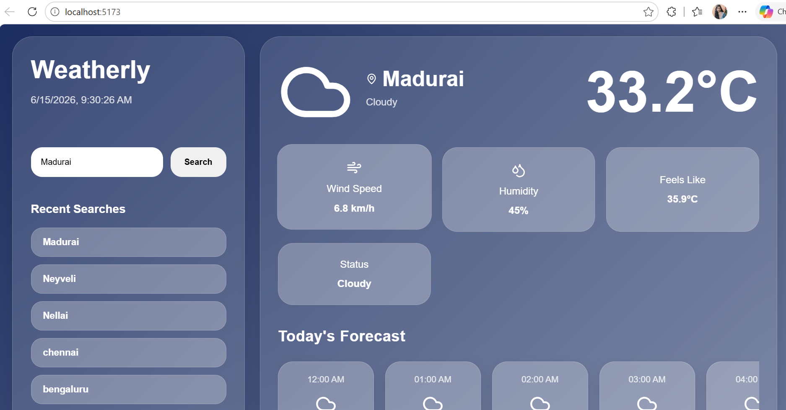
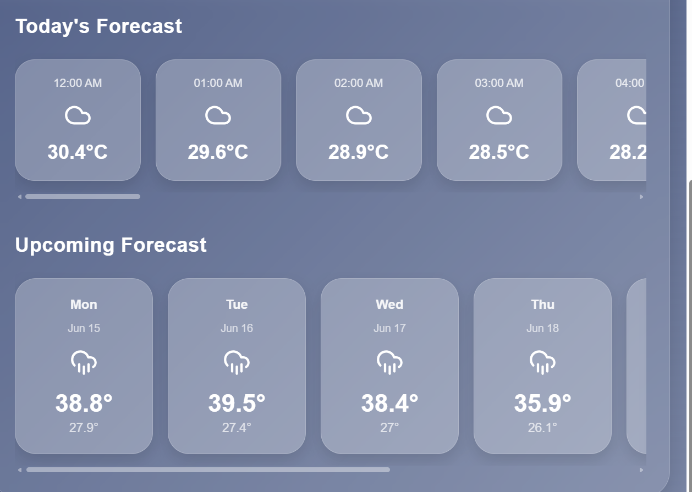
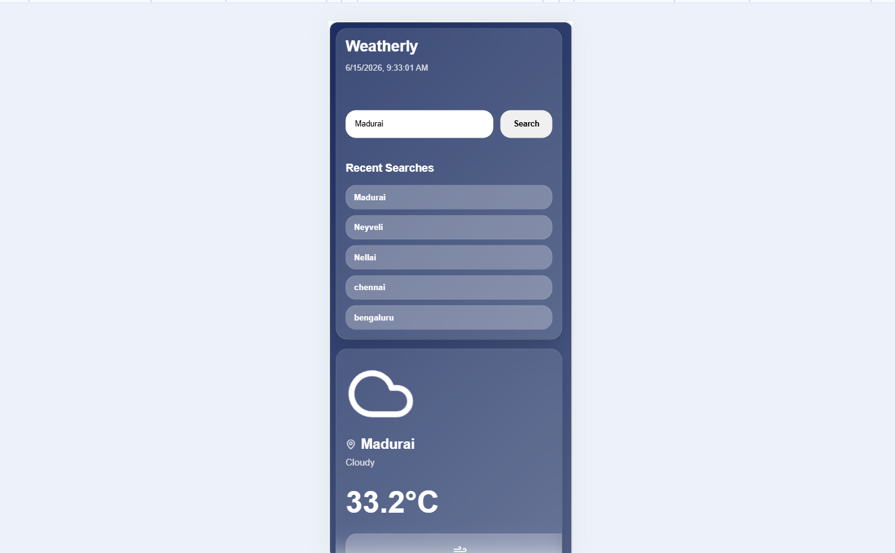

# Weather Application

## Project Overview
This Weather Application is a web-based tool that provides real-time weather information for any selected city. It fetches live data from a weather API and displays key meteorological details in a clean and responsive user interface.

---

## Features
- Search weather information by city name
- Display current temperature in Celsius
- Show humidity and wind speed
- Provide weather condition descriptions (e.g., clear, cloudy, rain)
- Responsive design for different screen sizes

---

## Technology Stack
- Frontend: Svelte / SvelteKit
- Language: JavaScript / TypeScript
- API Integration: OpenWeatherMap API
- Styling: CSS

---

## Project Structure
src/
├── lib/
│   ├── api/
│   │   └── weather.ts
│   │
│   ├── assets/
│   │   └── favicon.svg
│   │
│   ├── components/
│   │   ├── HourForecast.svelte
│   │   ├── SearchBar.svelte
│   │   ├── ThemeToggle.svelte
│   │   └── WeeklyForecast.svelte
│   │
│   ├── types/
│   │   └── weather.ts
│   │
│   └── utils/
│       └── weather.ts
│
└── routes/
    ├── +layout.svelte
    └── +page.svelte

## Application Snapshots

| Feature | Preview |
|--------|--------|
| Search Home |  |
| Forecast |  |
| Mobile Responsive |  |

